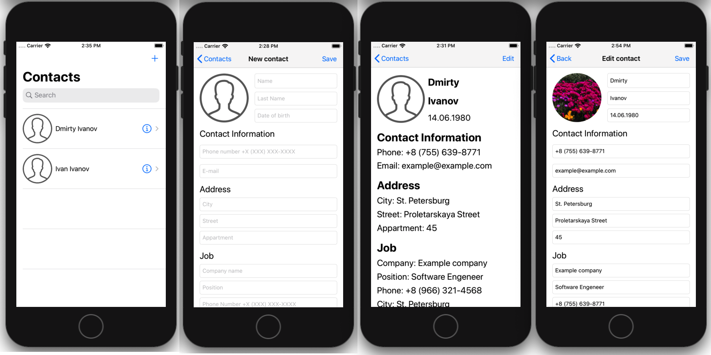

# Contacts

Приложение представляет из себя телефонную книжку. 
Состоит из 4 окон: 
- Список контактов. Список выводится в отсортированном виде, можно осуществлять поиск по контактам, а также удалить контакт;
- Добавление контакта. Вью позволяет создать карточку контакта. Карточка контакта содержит: Фото, Имя, Фамилию, Дату рождения, номер телефона, адрес, место работы.
- Окно просмотра контакта. Выводит детальную информацию о выбранном контакте. так же имеет кнопку "Редактировать".
- Окно редактирования карточки контакта.

Приложение локализованное на русский и английский языки.

## Stack: 

- Верстка в Storyboard
- SOLID
- CoreData
- CleanSwift
- Локализация NSLocalazideString

## Screenshots:

